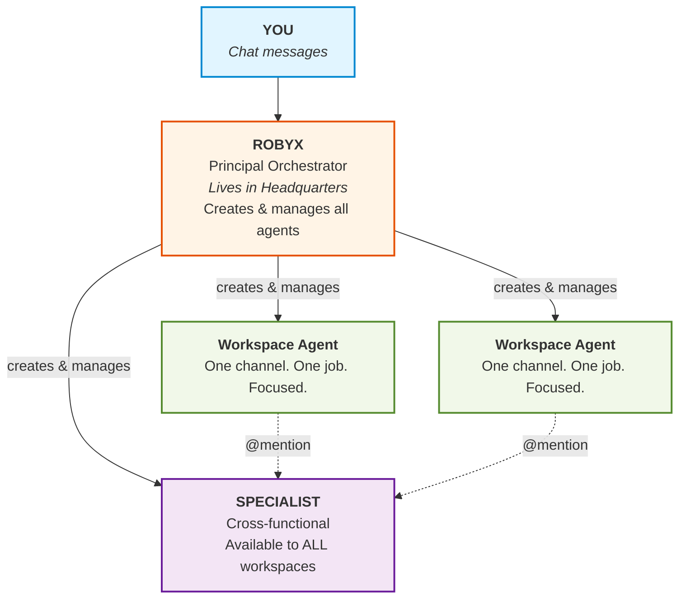
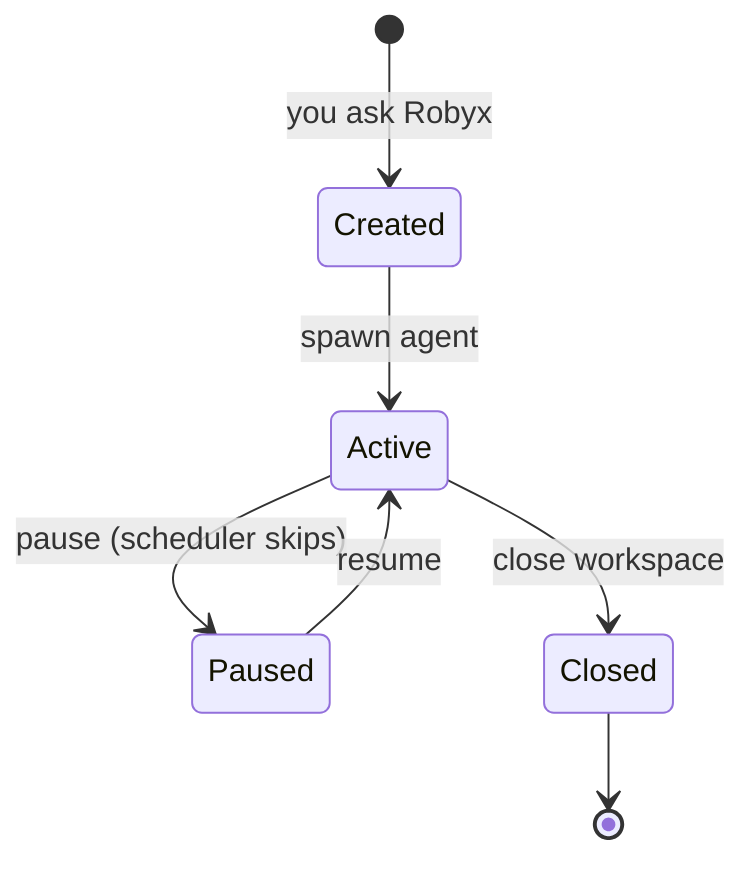

# Architecture

← [Back to README](../README.md)

## How It Works

You talk to **Robyx** in **Headquarters** — the control channel where the orchestrator lives. Robyx understands your requests, creates the right agents, and coordinates everything.

```
You:   "Create a workspace to monitor BTC price every hour, alert me below 60k"
Robyx:  Creates a scheduled workspace. Agent checks price hourly,
       sends alerts to its dedicated topic/channel.

You:   "I need a code reviewer that knows our Python conventions"
Robyx:  Creates a cross-functional specialist. Available to all
       workspaces via @code-reviewer.

You:   "Remind me Thursday at 9am — dentist appointment"
Robyx:  Schedules a [REMIND] entry. The Python reminder engine fires
       at the exact minute, survives bot restarts, no LLM needed.
```

Reminders are a **universal skill**: any agent in Robyx — Robyx, workspaces, specialists, and focused-mode agents — can schedule one with the `[REMIND ...]` pattern. The bot parses the pattern, queues it into the unified `data/queue.json`, and the scheduler delivers the message at the exact time. See **Reminders** in [`ORCHESTRATOR.md`](../ORCHESTRATOR.md) for the attribute reference.

Every agent lives in its own topic/channel. You can talk to any agent directly by opening it, or use `/focus <name>` to redirect all messages to that agent.

---

## The Three Roles

Robyx has three types of agents, each with a distinct purpose:



<details><summary>ASCII fallback (for terminals and non-rendering viewers)</summary>

```
                        ┌──────────────────────────┐
                        │          YOU              │
                        │      (Chat messages)      │
                        └────────────┬─────────────┘
                                     │
                                     ▼
                        ┌──────────────────────────┐
                        │        ROBYX              │
                        │  Principal Orchestrator   │
                        │  Lives in Headquarters    │
                        │  Creates & manages all    │
                        │  agents and workspaces    │
                        └──┬─────────┬──────────┬──┘
                           │         │          │
              ┌────────────▼──┐  ┌───▼────────┐ │
              │  WORKSPACE    │  │ WORKSPACE   │ │
              │  Agent        │  │ Agent       │ │
              │               │  │             │ │
              │ One channel.  │  │ One channel.│ │
              │ One job.      │  │ One job.    │ │
              │ Focused.      │  │ Focused.    │ │
              └──────┬────────┘  └──────┬──────┘ │
                     │                  │        │
                     │   ┌──────────────▼────┐   │
                     └──►│   SPECIALIST      │◄──┘
                         │   Cross-functional│
                         │                   │
                         │ Available to ALL   │
                         │ workspaces via     │
                         │ @mention           │
                         └───────────────────┘
```

</details>

### Robyx — The Orchestrator

Robyx is your single point of contact. It lives in **Headquarters** — the control channel of Robyx — and handles:

- **Creating workspaces** when you describe a task or project
- **Spawning specialists** when cross-functional expertise is needed
- **Delegating work** to the right agent
- **Managing focus** — routing your messages to the correct agent
- **Coordinating** the overall team

You never need to configure agents manually. Just describe what you need, and Robyx builds it.

**Headquarters is coordination-only.** Robyx treats the control channel as a dispatch point, not a workbench. Fleet status, workspace creation, delegation, and meta-operations belong in Headquarters; real project work (R&D iterations, builds, deploys, feature implementation) belongs in the workspace topic/channel of the project that owns it. When a request implies deep work inside a specific project, Robyx offers `[DELEGATE @agent: ...]` or suggests switching to the workspace topic/channel — it does not silently start executing from Headquarters.

### Workspace Agents — The Workers

Each workspace is its own **topic/channel** with a **dedicated AI agent**. The agent:

- Has its own conversation history (persistent sessions)
- Runs in its stored `work_dir` on your machine
- Follows custom instructions written by Robyx (or by you)
- Can request help from specialists

New workspaces inherit the configured `ROBYX_WORKSPACE` (or legacy `KAELOPS_WORKSPACE`) as their initial `work_dir`.

A workspace is not limited to a single mode — the same agent can respond interactively when you message it, run scheduled tasks on a timer, and have continuous autonomous work in progress. See [Scheduler](scheduler.md) for the full range of what agents can do.

For iterative, long-running work (R&D loops, optimization, training cycles), agents support the **agentic loop** mechanism. You can trigger it explicitly with `/loop` or let the agent suggest it when it recognizes the need from conversation context. The setup interview records objective, stopping criteria, constraints, and checkpoint policy in revisioned `program.json`; `plan.md` is its human-readable projection. Each task gets a dedicated topic for reports, pinned questions, incidents, and final notices, while lifecycle control remains available from the parent workspace agent. Four checkpoint policies govern when the step agent may hand control back (`on-demand`, `on-uncertainty`, `on-milestone`, `every-N-steps`). See [Scheduler — Continuous Tasks](scheduler.md#continuous-tasks-agentic-loop) for the full reference.

### Specialists — The Experts

Specialists are **horizontal agents** that serve all workspaces. Think of them as team-wide resources:

- A **code reviewer** that any workspace can ask for a review
- A **deployer** that knows your infrastructure
- A **researcher** that can deep-dive into any topic

Any workspace agent can call a specialist with `@name`. The specialist responds in the requesting workspace's topic/channel, keeping context local.

---

## Workspaces

A workspace is the fundamental unit of Robyx. When Robyx creates one, this is what happens:

```
1. Topic/channel created           →  #btc-monitor
                                       (forum topic on Telegram,
                                        channel on Discord/Slack)
2. Agent instructions generated    →  data/agents/btc-monitor.md
3. Scheduler entry written         →  data/queue.json (one-shot/periodic/continuous)
                                       (interactive workspaces are agent-only)
4. Data directory created          →  data/btc-monitor/
5. Agent activated                 →  ready to work
```

### Lifecycle



<details><summary>ASCII fallback</summary>

```
    You ask Robyx ──→ [Created] ──→ [Active] ──→ [Closed]
                                      │
                                      ▼
                                   [Paused]
                                   (scheduler
                                    skips it)
```

</details>

- **Active** — agent works, responds, and maintains its state
- **Paused** — agent stops; you can resume anytime
- **Closed** — the platform topic/channel is archived or closed; the agent is removed

### Talking to Workspaces

Three ways to interact with a workspace agent:

1. **Open its topic/channel** — messages go directly to that agent
2. **@mention** — write `@agent-name do something` from any channel
3. **Focus mode** — `/focus agent-name` routes ALL your messages to that agent until you say "back to Robyx"

---

## Collaborative Workspaces

Collaborative workspaces let external collaborators join a **separate Telegram group, Discord guild (since v0.28.0), or Slack channel (post spec 008)** with a dedicated AI agent. Unlike standard workspaces (which live as topics in the HQ supergroup and are owner-only), collaborative workspaces support multiple users with role-based authorization.

### Roles

| Role | Can talk | Executive instructions | Manage roles | Close workspace |
|------|----------|----------------------|--------------|-----------------|
| **Owner** | Yes | Yes | Yes | Yes |
| **Operator** | Yes | Yes | No | No |
| **Participant** | Human chat only | No | No | No |

- The bot owner (from `.env`) is always treated as Owner in every collaborative workspace.
- The person who creates the workspace starts as Owner.
- New group members are auto-registered as Participants.
- Messages from executive users (Owner/Operator) are tagged with `[EXECUTIVE]`
  so the agent knows to follow their instructions. Participant AI execution is
  disabled by default. Operators may explicitly opt in to the stateless,
  backend-restricted `read-only` profile only where readable workspace content
  is safe to disclose; participant turns never receive executive authority or
  persistence.

### Interaction Modes

- **Intelligent** (default) — executive messages reach the agent, which decides
  whether to respond. Participant messages follow the separate disabled/read-only
  policy above.
- **Passive** — executive messages require an explicit @mention or direct
  instruction; participant execution remains governed by the same security
  policy.

### Creation Flows

**Flow A (pre-announced):** Robyx or a workspace agent creates a pending collaborative workspace, then the owner adds the bot to a Telegram group or Discord guild/channel. The bot matches the pending request and configures itself automatically. Slack lifecycle provisioning remains deferred to spec 008.

**Flow B (ad-hoc):** The owner adds the bot to a chat with no prior setup. When
the platform event proves who added it, the bot creates a provisional workspace
and asks directly in the chat what it should focus on and whether to inherit
from an existing workspace. On Discord this requires `View Audit Log`; without
verified inviter identity, ad-hoc Flow B fails closed.

### Platform lifecycle abstraction (spec 007)

Lifecycle events — "bot added", "bot removed", "supergroup migrated" — are dispatched through three platform-agnostic dataclasses defined in `bot/messaging/base.py`:

```
ChatRef(platform, chat_id)         # canonical identifier per platform
LifecycleAdded(chat_ref, chat_title, added_by_id, added_by_name, raw_event)
LifecycleRemoved(chat_ref, chat_title, raw_event)
LifecycleMigrated(old_chat_ref, new_chat_ref, raw_event)
```

Telegram and Discord translate native events into these dataclasses and dispatch
through the same `Platform.on_added` / `on_removed` / `on_migrated` callback
attributes. Slack exposes the shared wiring but intentionally emits only its
documented unsupported advisory until spec 008 implements channel lifecycle.
Handler bodies branch on `event.chat_ref.platform` only where required by
platform semantics.

`chat_id` is the canonical string form per platform:

| Platform | Form | Example |
|---|---|---|
| Telegram | `"<chat_id_int>"` | `"-1001234567890"` |
| Discord | `"<guild_id>:<channel_id>"` | `"123456789012345678:987654321098765432"` |
| Slack | `"<team_id>:<channel_id>"` (post spec 008) | `"T01ABC:C02DEF"` |

Discord's `on_guild_join` does not carry the inviter; the adapter resolves it via the guild's audit log with three-retry exponential backoff (1s/2s/4s) and falls back to the `/im-the-owner <workspace-name>` chat command when the lookup fails. See [Building Your Team — Collaborative workspaces — Discord](team.md#collaborative-workspaces--discord).

### In-Group Commands

These commands work inside a collaborative workspace group:

- `/promote <user_id>` — Promote a participant to operator (owner only)
- `/demote <user_id>` — Demote an operator to participant (owner only)
- `/role` — Show all users and their roles
- `/mode intelligent|passive` — Switch interaction mode (owner only)
- `/close` — Close the workspace (creator only)

### Data

Collaborative workspace state is persisted in `data/collaborative_workspaces.json`. Each workspace tracks its `platform` (one of `telegram`, `discord`, `slack`), `chat_id` (canonical string form), roles, interaction mode, invite link, parent workspace reference, and `expected_platform` for pending workspaces (cross-platform user-id collision guard, spec 007). The on-disk migration `bot/migrations/v0_28_0.py` normalises pre-007 records (legacy `chat_id: int` → `str`; default `platform: "telegram"`).

---

← [Back to README](../README.md)
